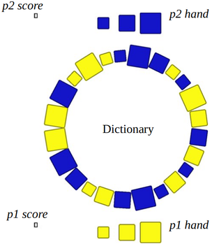

Iriri
=====

Iriri is a pattern matching game for icehouse pyramids. Players score points by laying “words” on a grid in a crossword-like manner. The possible words are determined by a “dictionary”, which shrinks as the game goes on.

Material
--------

Iriri is played with 1 stash of icehouse pyramids per player, meaning 15 pyramids, 5 of each size. Alternatively, any 6 sets of 5 tokens can be used, as long as it is clear to which player each belongs.

Definitions
-----------

- Dictionary: pieces arranged in a circle. Pieces are taken from here, shrinking the circle.
- Board: the play area which is initially empty, where players place sequences of pieces connected orthogonally
- Word: a connected row or column of at least 2 pieces of any colour on the board, bounded on both sides by an empty space
- Valid word: a word which can be matched to a sequence of adjacent pieces in the dictionary at the moment of play. Both the colour and size of every piece must match. Direction doesn’t matter. For the purpose of matching, the dictionary is considered an infinite loop.
- Hand: a set of 3 pieces from which a player can play words on the board. Hands are public information.

Setup and first turns
---------------------

- Each player chooses a (different) colour and takes a stash (i.e. 15 pyramids, 5 of each size) in that colour.
- Each player takes 1 pyramid of each size from their stash into their hand.
- Shuffle all other pieces together and place them in a circle in random order. This is the dictionary.
- Player 1 begins the place phase of his turn by placing a valid word (of at least 2 pieces) in the empty play area. For this first turn on the empty board, player 1 scores three times the number of placed pieces + 0.5. Play continues as described below (i.e. with the take phase of player 1).

On your turn
------------

A turn consists of two phases: place and take. They are always performed in that order by a single player, after which the turn passes to the next player. Both phases are mandatory (i.e. no passing or skipping a phase), unless no move is possible.

### Place phase

- Place one or more pieces from your hand on the board, connected (orthogonally) in at least one place to the rest of the pyramids.
  - All placed pieces must lie on a single horizontal or vertical line, with no empty spaces between them.
  - Pieces may be placed on both sides of existing pieces, between existing pieces, etc.. as long as they satisfy the above rule.
  - Each word on the play area of which the newly placed pieces are part, both horizontal and vertical, must be a valid word at the time of placement, according to the current dictionary.
- For each word you formed, score 1 point per piece. Although you may only place pieces of your own colour, you score points for pieces of the opponent’s colour as well. If a piece is part of 2 newly formed words, count it twice.
- If you can’t form a valid word, you must pass.

### Take phase

- Refill your hand to 3 pieces, by taking pieces of your colour from the dictionary. You cannot take the last piece of a specific type (size + colour), so one piece of every type will remain in the dictionary to the very end. Other than this, you may freely choose which pieces to take, i.e. any combination of sizes from whichever positions you like.
- After removing a piece from the dictionary, close the gap so that the pieces on either side are now adjacent.
- If too few pieces remain to fill up your hand, take as many as possible.
- If you can’t take any more pieces, skip this phase. It does not count as a pass. You may still perform the place phase of your next turn even with fewer than 3 pieces in hand.

Game end
--------

- The game ends when no player can make a move, i.e. all players have been forced to pass in succession.
- The player with the highest score is the winner.

Figures
-------

_Figure 1: Example setup_

_Figure 2: Example first move, with the match highlighted in curly brackets. P1 ends his turn by taking the pieces marked with arrows, resulting in Fig. 3._

_Figure 3: P2 (blue) to move_

_Figure 4: A more complex match example. P2 scores 6 points by placing the large blue piece_

_Figure 5: Finished game, blue wins 36-35.5_
